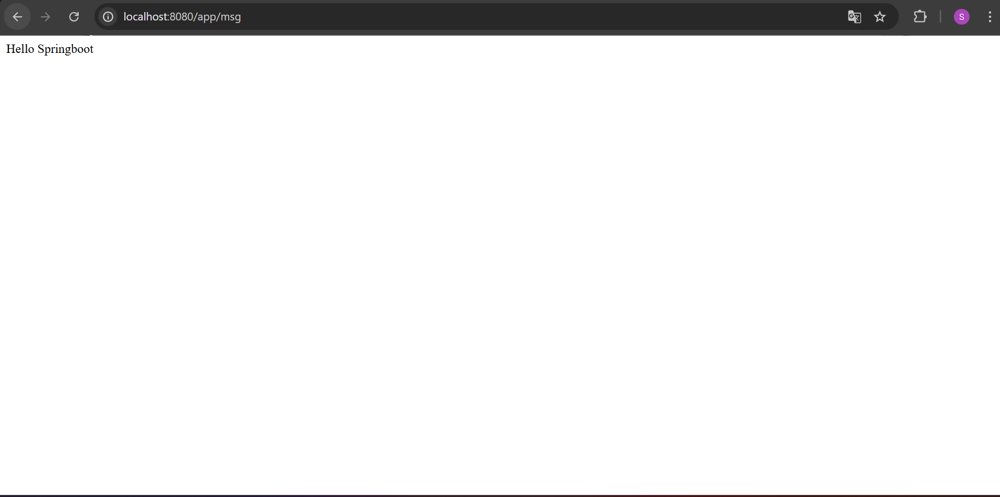
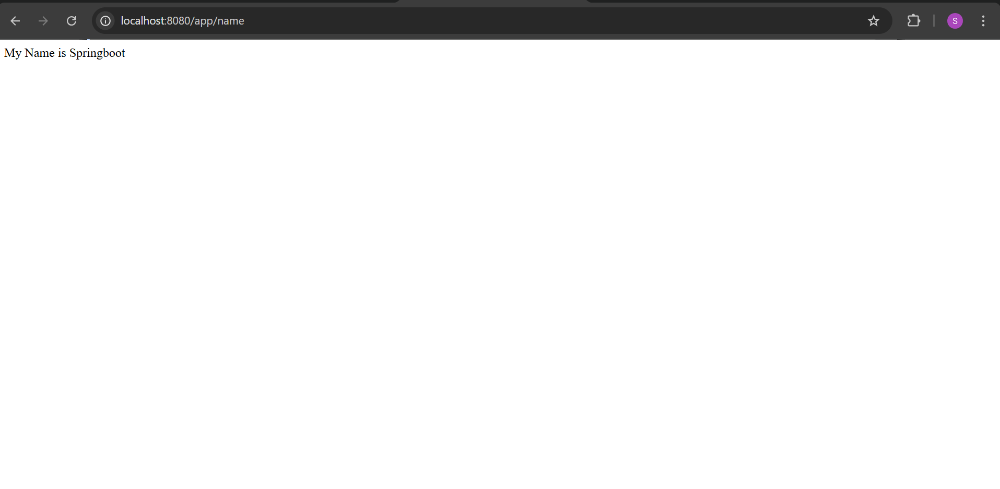

# java-spring-boot
## Overview
This is a simple Spring Boot application that exposes REST endpoints to return predefined messages.

## Project Structure

AppController.java: Contains the REST API endpoints.

@RestController: Indicates that this class handles REST requests.

@RequestMapping("/app"): Maps all endpoints under /app.

@GetMapping("/msg"): Returns a welcome message.

@GetMapping("/name"): Returns a predefined name message.

## Technologies Used
Java – The primary programming language for the application.

Spring Boot – A framework for building Java-based RESTful web services.

Maven – Dependency management and build automation tool.

## Endpoints

### 1. Get Message

URL: localhost:8080/app/msg

Output:

### 1.  Get Name

URL: localhost:8080/app/name

Output:

## How to Run

Ensure you have Java 17+ and Spring Boot installed.

Run the project.

